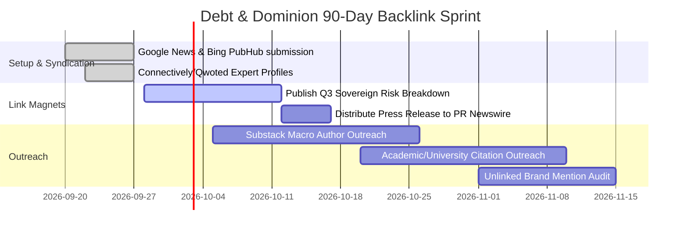

# Debt & Dominion: Comprehensive Backlink Acquisition & Distribution Strategy

## 1. Executive Summary

This document outlines the strategic roadmap for establishing **Debt & Dominion** as an authoritative, high-Domain Rating (DR) media outlet in geopolitics, macroeconomics, technology, and global power structures. 

Backlinks from top-tier academic, institutional, and journalistic domains serve as both Google search ranking catalysts and high-converting referral channels.

---

## 2. On-Site Backlink Enablers (Already Implemented)

To maximize link velocity, the platform has been equipped with built-in viral mechanics:

1. **One-Click Academic & Media Citation Tool (`ArticleShareBar`)**:
   - Every article includes automated **APA** and **BibTeX** citation generators.
   - Researchers, university students, and Substack writers can cite Debt & Dominion with zero friction.
2. **Native Social Sharing (`LinkedIn`, `X`, `WhatsApp`, `Copy Link`)**:
   - Direct distribution buttons with pre-filled editorial headlines.
3. **OpenGraph & Twitter Card Meta Optimization**:
   - Rich media cards with 1200x630 banners render across LinkedIn, Twitter, Discord, and Slack.
4. **Machine-Readable AI Standard (`/llms.txt` and `/sitemap.xml`)**:
   - Enables Perplexity, ChatGPT, Claude, and Gemini to reliably surface and attribute Debt & Dominion URLs in AI responses.

---

## 3. High-Impact Linkable Assets ("Link Magnets")

Journalists and analysts do not link to generic news; they link to **primary sources, proprietary data, and unique frameworks**.

### Asset Type 1: The Sovereign Power & Debt Index (Annual/Quarterly)
- **Concept**: A comparative index scoring nations on debt sustainability, defense autonomy, and technological self-reliance.
- **Why It Wins Links**: Financial bloggers, macro analysts, and academic researchers require reference charts to embed in their own articles.
- **Target Linkers**: Bloomberg Opinion readers, Substack macro analysts, university economics blogs.

### Asset Type 2: Deep-Dive Investigative Policy Briefs
- **Concept**: Long-form 3,000+ word structural reports on overlooked geopolitical choke points (e.g., Rare earth corridors, Naval choke points, Subsea fiber-optic vulnerability).
- **Target Linkers**: Think tanks (RUSI, Chatham House, Atlantic Council, CSIS).

### Asset Type 3: The AI Geopolitics Tracker
- **Concept**: A curated taxonomy tracking semiconductor export controls, sovereign GPU clusters, and national AI security regulations.
- **Target Linkers**: Tech blogs (TechCrunch, Ars Technica, Hacker News, The Verge).

---

## 4. Digital PR & Journalist Pitching Playbook

### Step 1: Connectively / HARO & Qwoted Execution
- Sign up for **Connectively** (formerly HARO), **Qwoted**, and **Help A B2B Writer** under Editor-in-Chief **Vedika Joshi**.
- Daily query scan for categories:
  - *Business & Finance*
  - *National Defense & Geopolitics*
  - *Tech & AI Regulation*
- **Response Protocol**: Submit concise, data-backed quotes within 60 minutes of query posting. Always include a link to the relevant Debt & Dominion analysis article for context.

### Step 2: Substack & Independent Newsletter Outreach
- Identify top 50 macro, geopolitical, and defense Substack newsletters (e.g., Noahpinion, Doomberg, Sinocism, Peter Zeihan followers).
- Engage with authors via comments and direct outreach suggesting complementary reading from Debt & Dominion:
  > *"Hi [Author], loved your perspective on [Topic]. We recently published an analytical breakdown on the sovereign financing angle of this exact issue: [Link]. Might be a valuable resource for your readers in your next roundup."*

### Step 3: Unlinked Brand Mention Reclaim
- Set Google Alerts and Talkwalker Alerts for:
  - `"Debt & Dominion"`
  - `"Vedika Joshi" "Debt & Dominion"`
- Whenever a publication mentions Debt & Dominion without hyperlinking:
  - Send a polite editorial email thanking them and requesting a direct attribution link to `https://debtanddominion.com`.

---

## 5. Institutional & Academic Outreach (.edu / .ac.uk)

Backlinks from educational and governmental domains carry unmatched algorithmic trust.

1. **University Economics & Finance Departments**:
   - Leverage connections with the **University of Winchester**, Oxford programmes, and student economics journals.
   - Contribute guest essays or collaborative research working papers linking back to Debt & Dominion author profiles.
2. **Naval & Defense Networks (URNU / Military Academies)**:
   - Author analytical pieces examining maritime logistics, critical trade routes, and naval procurement.
   - Cross-link with service journals, defense think tanks, and maritime strategy blogs.

---

## 6. News Aggregators & Tier-1 Directories

Ensure Debt & Dominion is officially indexed across primary news syndication feeds:

| Platform | Verification Action | Value |
| :--- | :--- | :--- |
| **Google News Publisher Center** | Submit RSS feed (`https://debtanddominion.com/sitemap.xml`) via Google Publisher Center | Instant Google News carousel eligibility |
| **Bing News PubHub** | Submit verified domain through Bing Webmaster Tools | Syndication into Bing Search & Windows News widgets |
| **Apple News** | Register for Apple News Publisher format | Massive mobile reader reach & referral links |
| **Feedly & Flipboard** | Create an official Debt & Dominion Flipboard Magazine | High-domain curation links |

---

## 7. 90-Day Execution Roadmap

### Key Metrics to Monitor:
- **Referring Domains (RD)**: Target 50+ unique high-quality domains in first 60 days.
- **Organic Keywords in Top 10**: Track movements for target terms (*"sovereign debt geopolitics"*, *"tech dominion"*, *"macroeconomic intelligence"*).
- **Referral Traffic Share**: Aim for 15-25% of monthly visits driven by citation links and newsletter roundups.
